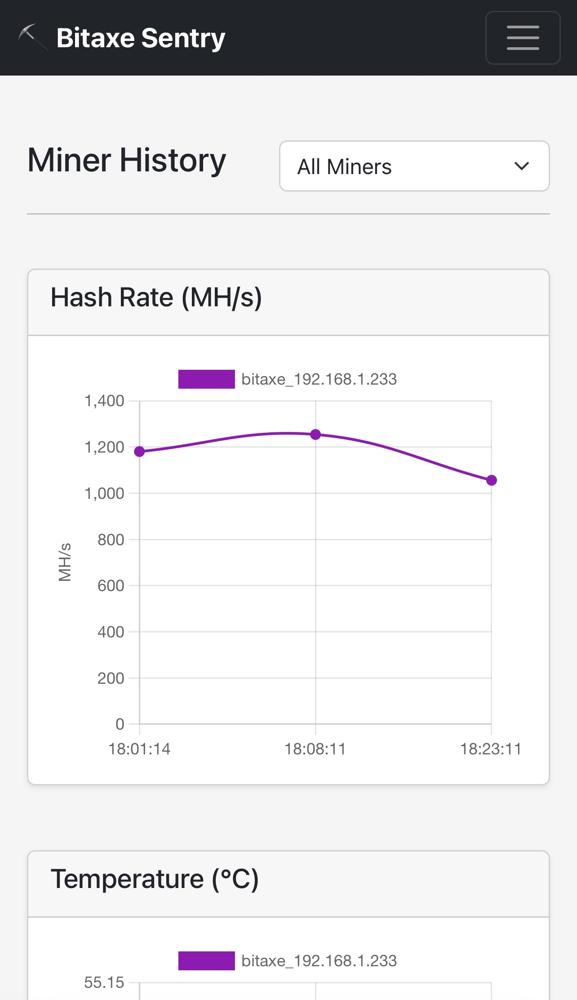

# Bitaxe Sentry

A monitoring system for Bitaxe miners that tracks performance metrics, sends alerts, and provides a web dashboard.

## Overview

Bitaxe Sentry is a lightweight monitoring solution for bitaxe cryptocurrency miners. It periodically polls miner endpoints, stores the data in an SQLite database, sends alerts via Discord when temperature or voltage thresholds are exceeded, and provides a lightweight dashboard to visualize miner performance.

### Features

- 📊 **Metrics Tracking**: Monitors hash rate, temperature, voltage, and best difficulty
- 🚨 **Alert System**: Discord notifications for temperature thresholds and new best difficulty records
- 📱 **Web Dashboard**: Web interface for real-time monitoring and history charts
- 📊 **Mobile Friendly**: Responsive design works great on smartphones and tablets
- 🔄 **Automatic History Cleanup**: Configurable data retention period
- 🐳 **Docker Support**: Easy deployment with Docker and Docker Compose

## Screenshots

### Dashboard View


### History View


## Quick Start

### Run with Docker (Recommended)

```bash
# Clone the repository
git clone https://github.com/zachchan105/bitaxe-sentry.git
cd bitaxe-sentry

# Create and configure your .env file
cp .env.example .env
nano .env  # Edit with your miner endpoints and Discord webhook

# Start the services
docker compose up -d
```

## Configuration

### Environment Variables

- `POLL_INTERVAL_MINUTES`: How often to poll miners (default: 15)
- `RETENTION_DAYS`: How long to keep historical data (default: 30)
- `TEMP_MIN`: Minimum acceptable temperature in °C (default: 20)
- `TEMP_MAX`: Maximum acceptable temperature in °C (default: 70)
- `VOLT_MIN`: Minimum acceptable volatge (default: 5)
- `BITAXE_ENDPOINTS`: Comma-separated list of miner endpoint URLs (e.g., `http://192.168.1.233`)
- `DISCORD_WEBHOOK_URL`: Discord webhook for notifications

## Web Dashboard

Once running, access the web dashboard at:
- http://your-server-ip:7070 (when running in Docker)

## Support Development

If you find this project useful, consider supporting its development:

**Bitcoin**: `bc1qrnywctt0lerrfgyqj5fvf7aulp5rvtr9as25uq`

 